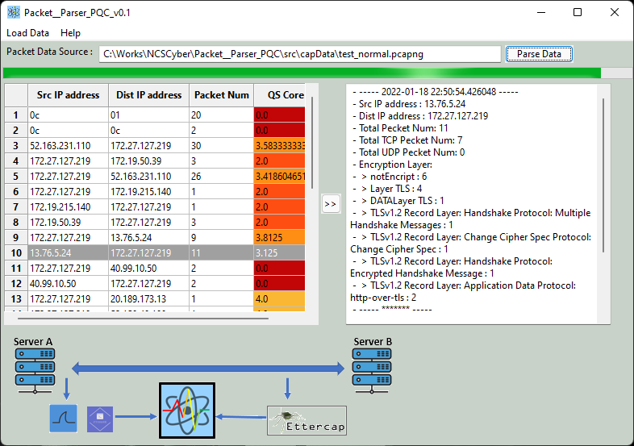
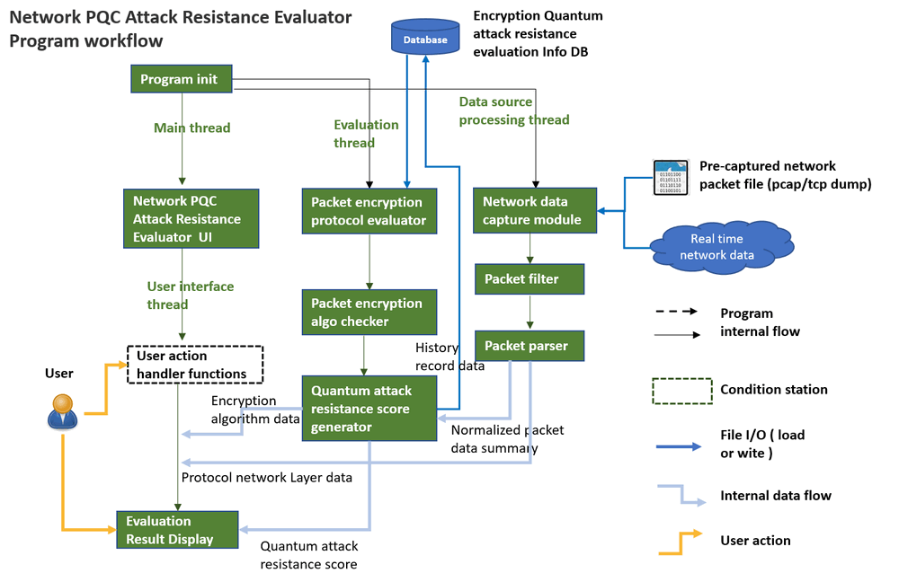
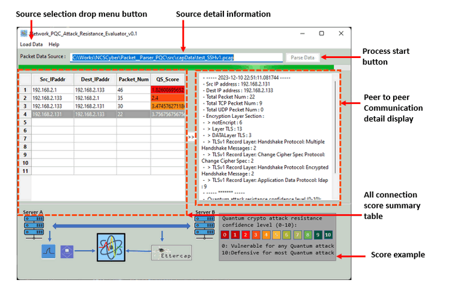
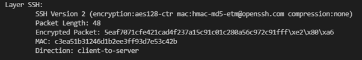
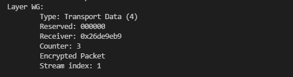
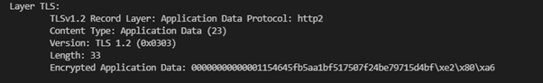
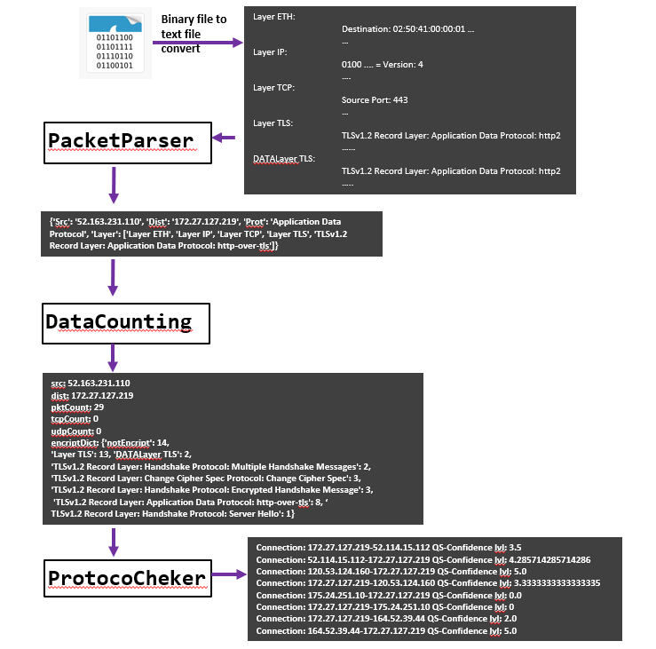
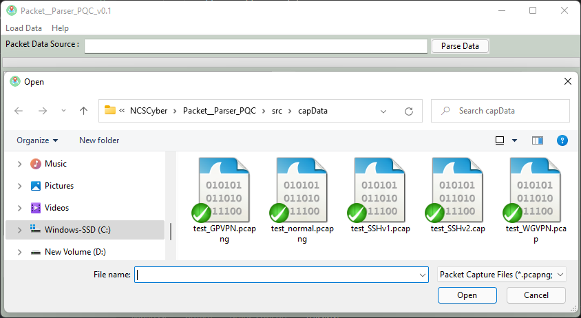
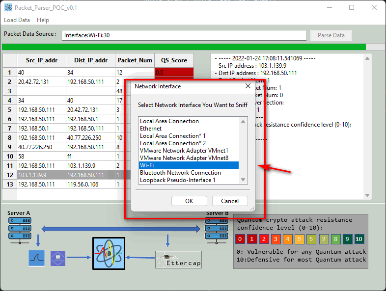

# Network PQC Attack Resistance Evaluator
**Program Design Purpose **: Post-quantum cryptography (PQC), often referred to as quantum-proof, quantum-safe, or quantum-resistant, focuses on the development of cryptographic algorithms, primarily public-key algorithms, designed to withstand potential cryptanalytic attacks by quantum computers. The purpose of our Network PQC Attack Resistance Evaluator program is to create a dynamic monitoring and evaluation tool. This tool aims to check and test the resistance level / resilience of communication between two points, such as two servers, against Quantum Crypto Attacks. By utilizing this tool, users can gauge the effectiveness of cryptographic measures in real-time, ensuring robust security in the face of emerging quantum threats.

[TOC]

- [Packet_Parser [PQC]](#packet-parser--pqc-)
    + [Introduction](#introduction)
          + [Packet_Parser_PQC Main UI View:](#packet-parser-pqc-main-ui-view-)
    + [Program Design](#program-design)
          + [Packet Collection Module](#packet-collection-module)
          + [Protocol parsing and match module](#protocol-parsing-and-match-module)
          + [Result visualization module](#result-visualization-module)
        * [Program Work Flow](#program-work-flow)
        * [Data Parsing Process](#data-parsing-process)
        * [Protocol QS Score Calculation](#protocol-qs-score-calculation)
      - [Program Setup](#program-setup)
          + [Development Environment : python 3.7.4](#development-environment---python-374)
          + [Additional Lib/Software Need](#additional-lib-software-need)
          + [Hardware Needed : None](#hardware-needed---none)
          + [Program Files List](#program-files-list)
      - [Program Usage](#program-usage)
          + [Program Execution](#program-execution)
          + [Load packets data from file](#load-packets-data-from-file)
          + [Load packet from network interface](#load-packet-from-network-interface)
      - [Problem and Solution](#problem-and-solution)

------

### Introduction

Post-quantum cryptographic algorithms are designed with the primary goal of securing systems against potential threats posed by quantum computers. These advanced computing machines have the capability to compromise widely utilized cryptographic schemes, including RSA and ECC. The objective of this project is to develop a sophisticated probe/scanner program. This program will analyze network packets exchanged between two points or all the packets coming in one host, providing a quantitative confidence level regarding their resistance to Quantum Crypto Attacks. The aim is to offer a robust and dynamic assessment tool that empowers users to gauge the security posture of their communication channels in the era of quantum computing advancements.

Given the inherent difficulty in simulating quantum crypto attacks with our current hardware, our focus is on parsing network packets from either the host/destination side or within the network midpoints. This approach enables the analysis of network communication protocols to determine their quantum safety. The methodology involves comparing identified protocols against our customizable comprehensive database of quantum-safe standards, specifically utilizing the NSA_Suite_B_Cryptography's Quantum Resistant Suite. For instance: 

- If a packet employs the OpenSSH 2.3.1(SSH2) protocol with aes128-ctr encryption, we conclude that it lacks resistance against Quantum Crypto Attacks.  
- If the packet employs the WireGuard protocol, leveraging Curve25519 for key exchange, ChaCha20 for symmetric encryption, Poly1305 for message authentication codes, SipHash for hashtable keys, and BLAKE2s for the cryptographic hash function, we express an 80% confidence level in its resistance against Quantum Crypto Attacks. This systematic evaluation ensures a nuanced understanding of the quantum resilience of various communication protocols, offering valuable insights into the security landscape.


##### Network PQC Attack Resistance Evaluator Main UI View

To enhance user experience, our tool includes a user-friendly interface that simplifies the process. Users can effortlessly select the monitor source, allowing them to then assess the P2P quantum attack resistance score along with detailed packet category information. Below is a glimpse of the Network PQC Attack Resistance Evaluator's user interface, providing a clear and intuitive platform for users to navigate and retrieve crucial information.. 



`Version: 0.2.1` 

The compatible input network data source can be pcap from Wireshark / t-shark, tcp dump or sniffed packet generate by Ettercap's mirroring function.


------

### Program Design

#### Program Modules Design Detail

The  Network PQC Attack Resistance Evaluator program contents three main parts: 

- Network traffic packet collection / sniffing module. 
- Protocol encryption algorithm quantum attack resistance evaluation module  . 

- User action heading and result visualization UI module.

The three module will running in three parallel thread and managed by the program main data manager, the detailed work flow is shown below :



`Version: 0.2.1` 

##### Network traffic packet collection / sniffing module

The Network Traffic Packet Collection/Sniffing module is designed to efficiently capture and load all communication packets from either a cap file or directly from the network interface. This module performs a meticulous filtering and categorization of packets based on user-defined settings. Subsequently, it normalizes the packet information, encompassing diverse layer details and message encryption algorithms. The processed information is then seamlessly transmitted to the Evaluation Module for in-depth analysis. This streamlined process ensures a comprehensive and organized approach to packet handling and sets the stage for thorough evaluation and assessment.

##### Protocol encryption algorithm quantum attack resistance evaluation module  

The system is equipped to retrieve a quantum attack resistance score map/dictionary from the database. During each communication session between two peers, the Evaluation Module systematically analyze different layers of the network protocol ( layers above the IP layer). Subsequently, it generates a distinctive mark representing the resistance ability against Quantum Crypto Attacks for that specific communication instance. 

The attack resistance evaluation results will be also archived in the database for future research applications. To ensure the relevance of our analysis, we commit to continuously updating the attack resistance score map/dictionary throughout our ongoing research. Additionally, users have the flexibility to customize their own resistance score maps, tailoring the evaluation process to meet their specific needs.

##### User action handling and result visualization UI module.

We also provide the UI/Dashboard to take the use source section then show all the communication between A and B in a list , the categorized all the packets by protocol  types and highlight the result we calculated to give the user a conclusion. The design of the User interface display is shown below : 



`Version: 0.2.1` 

#### Network Packet Evaluation Process 

Analyzing protocol intricacies begins with parsing details from the TCP/UDP layer. By meticulously matching the primitives employed by the protocol, we then derive a confidence level indicative of its resistance against Quantum Crypto Attacks. The imperative task of updating our database continually underpins our commitment to staying abreast of evolving research. As an illustrative example, the data parsed from the packet encompasses the following details:

For example we paring these data from the packet: 

**Example-1**: 

When we only check the data layer message encryption use `ssh` as shown below :  



We identify the communication has very low resistance ability for quantum crypto attack. Then give it low mark. 

**Example-2:**

When we only check the TCP layer encryption use `wg(wireguard)` as shown below : 



We identify the communication may have resistance ability for quantum crypto attack. Then we checked the message layer encryption use `TLC-v1.2`:



we will increase the mark to higher. 

Below is the detail work flow of the Data Parsing process : 



##### Protocol Quantum Attack Resistance  Score Calculation 

We calculate a protocol's quantum safe score based on the NSA_Suite_B_Cryptography ‘s Quantum resistant suite[https://en.wikipedia.org/wiki/NSA_Suite_B_Cryptography] For example the WireGuard protocol : 

| Standard                                                     | WG Used Algo | Match standard |
| ------------------------------------------------------------ | ------------ | -------------- |
| Advanced Encryption Standard (AES), per FIPS 197, using 256 bit keys to protect up to TOP SECRET | ChaCha20     | Yes            |
| Elliptic Curve Diffie-Hellman (ECDH) Key Exchange, per FIPS SP 800-56A, using Curve P-384 to protect up to TOP SECRET. | Curve25519   | No             |
| Elliptic Curve Digital Signature Algorithm (ECDSA), per FIPS 186-4 | Curve25519   | No             |
| Secure Hash Algorithm (SHA), per FIPS 180-4, using SHA-384 to protect up to TOP SECRET. | BLAKE2s      | Yes            |
| Diffie-Hellman (DH) Key Exchange, per RFC 3526, minimum 3072-bit modulus to protect up to TOP SECRETPoly1305 | Poly1305     | Yes            |
| RSA for key establishment (NIST SP 800-56B rev 1) and digital signatures (FIPS 186-4), minimum 3072-bit modulus to protect up to TOP SECRET | Poly1305     | Yes            |

So we give **WG[QS-Score]** = 6.6667

The current resistance score for each network layers protocol we use is shown below, user can also do the adjustment based on their requirement: 

```
{
    "Transport layer": {
        "DCCP": 0.0,
        "SCTP": 0.0,
        "UDP": 0.0,
        "UDP-Lite": 0.0,
        "TCP": 0.0,
        "PortReference": 0.0,
        "RTP": 0.0,
        "RTCP": 0.0
    },
    "Session layer": {
        "NetBIOS": 1.0,
        "NetDump": 1.0,
        "ONC-RPC": 1.0,
        "DCE-RPC": 1.0,
        "HTTP": 1.0,
        "SMTP": 1.0
    },
    "Presentation layer": {
        "MIME": 1.0
    },
    "Application layer": {
        "ANCP": 2.0,
        "BOOTP": 2.0,
        "DHCP": 2.0,
        "DNS": 2.0,
        "FTP": 2.0,
        "IMAP": 2.0,
        "iWARP-DDP": 2.0,
        "iWARP-MPA": 2.0,
        "iWARP-RDMAP": 2.0,
        "NTP": 2.0,
        "PANA": 2.0,
        "POP": 2.0,
        "RADIUS": 2.0,
        "RLogin": 2.0,
        "RSH": 2.0,
        "SSH": 4.0,
        "SSHv1": 3.0,
        "SSHv2": 5.0,
        "SNMP": 2.0,
        "Telnet": 2.0,
        "TFTP": 2.0,
        "SASP": 3.0,
        "TLS": 4.0,
        "TLSv1": 5.0,
        "TLSv1.1": 5.0,
        "TLSv1.2": 6.0,
        "TLSv1.3": 7.0,
        "WG": 8.0
    }
}
```

Higher score means have higher possible resistance ability for quantum crypto attack.


------

#### Program Setup

###### Development Environment : python 3.7.4

###### Additional Lib/Software Need

1. **wxPython** : https://docs.wxpython.org/index.html

   ```
   Install: pip install wxPython
   ```

2. **pyShark** / **tshark** : https://github.com/KimiNewt/pyshark

   ```
   Install: pip install pyshark
   ```

###### Hardware Needed : None

###### Program Files List 

| Program File           | Execution Env | Description                                        |
| ---------------------- | ------------- | -------------------------------------------------- |
| src/uiRun.py           | python 3      | Main user interface frame.                         |
| src/uiPanel.py         | python 3      | Result visualization display panel                 |
| src/pkgGlobal.py       | python 3      | Global parameter controller                        |
| src/PacketParser.py    | python 3      | Packet paring module.                              |
| src/ProtocolChecker.py | python 3      | Protocol matching and QS score calculation module. |
| src/DataMgr.py         | python 3      | Program internal data management module.           |
| ProtocolRef.json       |               | QS scores matching dictionary.                     |
| capData/*.cap, *capng  |               | Test packet capture data files.                    |


------

#### Program Usage

###### Program Execution 

```
python uiRun.py
```

###### Load packets data from file 

1. In the UI, select `Load Data` from the menu bar and select `Load From File`: 



2. Select the file and press `open` button, after file loaded press the `parse data` button


###### Load packet from network interface 

1. Run the program under **admin permission**. In the UI, select `Load Data` from the menu bar and select `Load From network interface`: 



2. Select the network interface you want to sniff.

3. set how long you want to sniff (interface: WI-Fi:**30** <- this number means sniff packets in 30 sec ), please void set the number too big. As I didn't use the file iterator to cache the packet data into a tmp file, so all the sniffed packet data will be saved in your computer memory. If you are watching a video and use the sniff function, there may be a memory error after running the sniff for a shot while. 

   

------

#### Problem and Solution

Refer to `doc/ProblemAndSolution.md`


------

> Last edit by LiuYuancheng (liu_yuan_cheng@hotmail.com) at 14/01/2022, if there is any problem or bug please send me a message.

