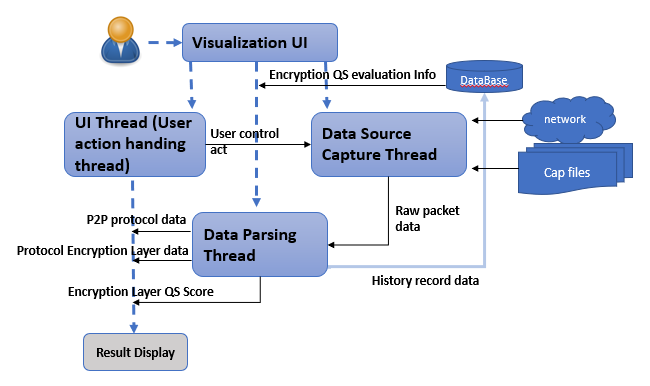

# Packet_Parser_PQC
**Program Design Purpose**: We want to check/test whether the communication between two point (such as 2 servers) has the resistance ability for Quantum Crypto Attack.

[TOC]

### Introduction

This project is aimed to develop a probe/scanner program to analysis the network packets between two points to give the confidence level of the resistance ability for Quantum Crypto Attack. 

As we don’t have the way to simulate the quantum crypto attack, so what we want is parsing the network packet from the host/dist side or in the mid to analysis the network communication protocol to identify whether the communication is quantum safe. We will compare the protocol with our data base quantum safe standard to give a value. The standard we want to use is NSA_Suite_B_Cryptography ‘s Quantum resistant suite. For example: 

- If we find the packet is using protocol OpenSSH 2.3.1(SSH2), as its encryption use aes128-ctr, we say it doesn’t have the resistance ability for Quantum Crypto Attack. 


- If we find the packet is using WireGuard protocol, as it is using Curve25519 for key exchange, ChaCha20 for symmetric encryption, Poly1305 for message authentication codes, SipHash for hashtable keys and BLAKE2s for cryptographic hash function, so we are 80% confident about it have the resistance ability for Quantum Crypto Attack. 


###### Packet_Parser_PQC Main UI View: 


`Version: 0.1` 


------

### Program Design

The program contents three main parts: 

·     Network traffic packet collection module.

·     Protocol parsing and matching module. 

·     Result visualization module.

###### Packet Collection Module

The Network traffic packet collection module will collect all the communication packet from the cap file or from the network interface. 

###### Protocol parsing and match module

Parsing the protocol detail from the TCP/UDP layer. Match the primitives used by the protocol then generate the confidence level of the resistance ability for Quantum Crypto Attack. Our database need to continuous update during our research.

###### Result visualization module

We want to design some UI/Dashboard to show all the communication between A and B in a list , then  categorized all the packet by protocol  types and highlight the result we calculated to give the user a conclusion. 

##### Program Work Flow 

Each module will run in a individual thread, the program work flow diagram is shown below: 



##### Data Parsing Process 

In the Data Parsing Module we parse the data with below sequence: 


------

#### Program Setup

###### Development Environment : python 3.7.4

###### Additional Lib/Software Need

1. **wxPython** : https://docs.wxpython.org/index.html

   ```
   Install: pip install wxPython
   ```

2. **pyShark** / **tshark** : https://github.com/KimiNewt/pyshark

   ```
   Install: pip install pyshark
   ```

###### Hardware Needed : None

###### Program Files List 

| Program File           | Execution Env | Description                                       |
| ---------------------- | ------------- | ------------------------------------------------- |
| src/uiRun.py           | python 3      | main UI frame                                     |
| src/uiPanel.py         | python 3      | Result visualization display panel                |
| src/pkgGlobal.py       | python 3      | Global parameter controller                       |
| src/PacketParser.py    | python 3      | Packet paring module.                             |
| src/ProtocolChecker.py | python 3      | Protocol matching and QS score calculation module |
| src/DataMgr.py         | python 3      | Program internal data management module           |
| ProtocalRef.json       |               | QS scores matching dictionary.                    |
| capData/*.cap, *capng  |               | Test packet capture data                          |


------

#### Program Usage

###### Program Execution 

```
python uiRun.py
```


------

#### Problem and Solution

Refer to `doc/ProblemAndSolution.md`


------

> Last edit by LiuYuancheng(liu_yuan_cheng@hotmail.com) at 14/01/2022

