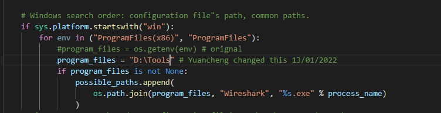

# **Problem and Solution**

**In this document we will share the valuable problems and the solution we meet during the project development as a reference menu for the new programmer who may take over this project for further development. Later we will sort the problem based on the problem <type>.**

[TOC]

**Format:** 

**Problem**: (Situation description)

**OS Platform** :

**Error Message**:

**Type**: Setup exception

**Solution**:

**Related Reference**:

------

###### Problem[1]: Share the android phone screen to PC for online demo with MS-Teams. 

**OS Platform** : Windows 

**Error Message**: 

```
PS C:\Works\NCSCyber\Packet__Parser_PQC\src> & C:/Users/liu_y/AppData/Local/Programs/Python/Python37-32/python.exe c:/Works/NCSCyber/Packet__Parser_PQC/src/PacketParser.py
Traceback (most recent call last):
  File "c:/Works/NCSCyber/Packet__Parser_PQC/src/PacketParser.py", line 4, in <module>
    capture.sniff(timeout=10)
  File "C:\Users\liu_y\AppData\Local\Programs\Python\Python37-32\lib\site-packages\pyshark\capture\capture.py", line 137, in load_packets
    self.apply_on_packets(keep_packet, timeout=timeout, packet_count=packet_count)
  File "C:\Users\liu_y\AppData\Local\Programs\Python\Python37-32\lib\site-packages\pyshark\capture\capture.py", line 274, in apply_on_packets
    return self.eventloop.run_until_complete(coro)
  File "C:\Users\liu_y\AppData\Local\Programs\Python\Python37-32\lib\asyncio\base_events.py", line 587, in run_until_complete
    return future.result()
  File "C:\Users\liu_y\AppData\Local\Programs\Python\Python37-32\lib\asyncio\tasks.py", line 442, in wait_for
    return fut.result()
  File "C:\Users\liu_y\AppData\Local\Programs\Python\Python37-32\lib\site-packages\pyshark\capture\capture.py", line 283, in packets_from_tshark
    tshark_process = await self._get_tshark_process(packet_count=packet_count)
  File "C:\Users\liu_y\AppData\Local\Programs\Python\Python37-32\lib\site-packages\pyshark\capture\live_capture.py", line 87, in _get_tshark_process
    dumpcap_params = [get_process_path(process_name="dumpcap", tshark_path=self.tshark_path)] + self._get_dumpcap_parameters()
  File "C:\Users\liu_y\AppData\Local\Programs\Python\Python37-32\lib\site-packages\pyshark\tshark\tshark.py", line 60, in get_process_path
    self.apply_on_packets(keep_packet, timeout=timeout, packet_count=packet_count)
  File "C:\Users\liu_y\AppData\Local\Programs\Python\Python37-32\lib\site-packages\pyshark\capture\capture.py", line 274, in apply_on_packets    return self.eventloop.run_until_complete(coro)
  File "C:\Users\liu_y\AppData\Local\Programs\Python\Python37-32\lib\asyncio\base_events.py", line 587, in run_until_complete
    return future.result()
  File "C:\Users\liu_y\AppData\Local\Programs\Python\Python37-32\lib\asyncio\tasks.py", line 442, in wait_for
    return fut.result()
  File "C:\Users\liu_y\AppData\Local\Programs\Python\Python37-32\lib\site-packages\pyshark\capture\capture.py", line 283, in packets_from_tshark
    tshark_process = await self._get_tshark_process(packet_count=packet_count)
  File "C:\Users\liu_y\AppData\Local\Programs\Python\Python37-32\lib\site-packages\pyshark\capture\live_capture.py", line 87, in _get_tshark_process
    dumpcap_params = [get_process_path(process_name="dumpcap", tshark_path=self.tshark_path)] + self._get_dumpcap_parameters()
  File "C:\Users\liu_y\AppData\Local\Programs\Python\Python37-32\lib\site-packages\pyshark\tshark\tshark.py", line 61, in get_process_path
    "Searched these paths: {}".format(possible_paths)
pyshark.tshark.tshark.TSharkNotFoundException: TShark not found. Try adding its location to the configuration file. Searched these paths: ['C:\\Program Files\\Wireshark\\dumpcap.exe', 'C:\\Program Files\\Wireshark\\dumpcap.exe', 'C:\\Program Files\\Wireshark\\dumpcap.exe']
```


**Type**: Software setup.

**Solution**: 

1. The problem is because wire Shark is not install in the C drive 

2. Open the file `Python\Python37-32\Lib\site-packages\pyshark\tshark`

3. Do the change: 

   

4. 

**Related Reference**:

https://blog.csdn.net/Dawn510/article/details/92799714


------

###### Problem[2]: I want to capture the packet using pyshark. but I could not capture the packet on windows 7.

**OS Platform** : Windows 10

**Error Message**:

Code: 

```
import pyshark
def NetCap():
    print 'capturing...'
    livecapture = pyshark.LiveCapture(interface="eth0", output_file='./test.pcapng')
    livecapture.sniff(packet_count=10)
    print 'end of capture.'
    print livecapture

if __name__ == "__main__":
    NetCap()
```

result: (Livecapture is 0 packets)

```
capturing...
end of capture.
<LiveCapture (0 packets)>
```

**Solution:**

open cmd with **windows admin permission** (This is important!) and cd to the :

```py
D:\>cd D:\Tools\Wireshark
D:\Tools\Wireshark>tshark -D
```

this will give you a list like:

```py
D:\Tools\Wireshark>tshark -D
1. \Device\NPF_{4F0FAC32-6553-401E-BBD4-6C2137063A4D} (Local Area Connection* 2)
2. \Device\NPF_{2728F59D-A4DB-4C89-A261-88E819ADC5BB} (Local Area Connection* 10)
3. \Device\NPF_{091AF408-257D-45A3-BCC9-586038BB69AA} (Ethernet 3)
4. \Device\NPF_{9ABE362E-3E4E-4243-8339-C26B54BFE68F} (VMware Network Adapter VMnet1)
5. \Device\NPF_{172B21B5-878D-41B5-9C51-FE1DD27C469B} (Wi-Fi)
6. \Device\NPF_{EBED9EB0-F08E-424F-A51A-F612E5C01A75} (Local Area Connection* 8)
7. \Device\NPF_{3C36F7BA-9CBB-4B91-8D2D-C9A95D4C5049} (Local Area Connection* 9)
8. \Device\NPF_{A4DD37BA-419B-41C1-A626-409FD34E6008} (VMware Network Adapter VMnet8)
9. \Device\NPF_{77832240-0D34-45D6-A193-FCF7D5E68903} (Local Area Connection* 1)
10. \Device\NPF_{51CF574B-6146-4D03-B4FF-E05EA2882356} (Bluetooth Network Connection)
11. \Device\NPF_Loopback (Adapter for loopback traffic capture)
12. \Device\NPF_{6150AC83-FA10-47B4-9802-41E194A3D6FE} (Ethernet)
13. \Device\NPF_{8F6C23C0-9B47-4A47-9698-0DCA7C15E5F1} (Local Area Connection)
```


now you can use any of the interface as required by this:

```
import pyshark
livecapture = pyshark.LiveCapture(interface='\\Device\NPF_{172B21B5-878D-41B5-9C51-FE1DD27C469B}, output_file='./test.pcapng')
```

link: https://stackoverflow.com/questions/35985296/pyshark-can-not-capture-the-packet-on-windows-7-python
