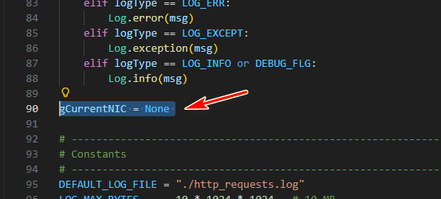
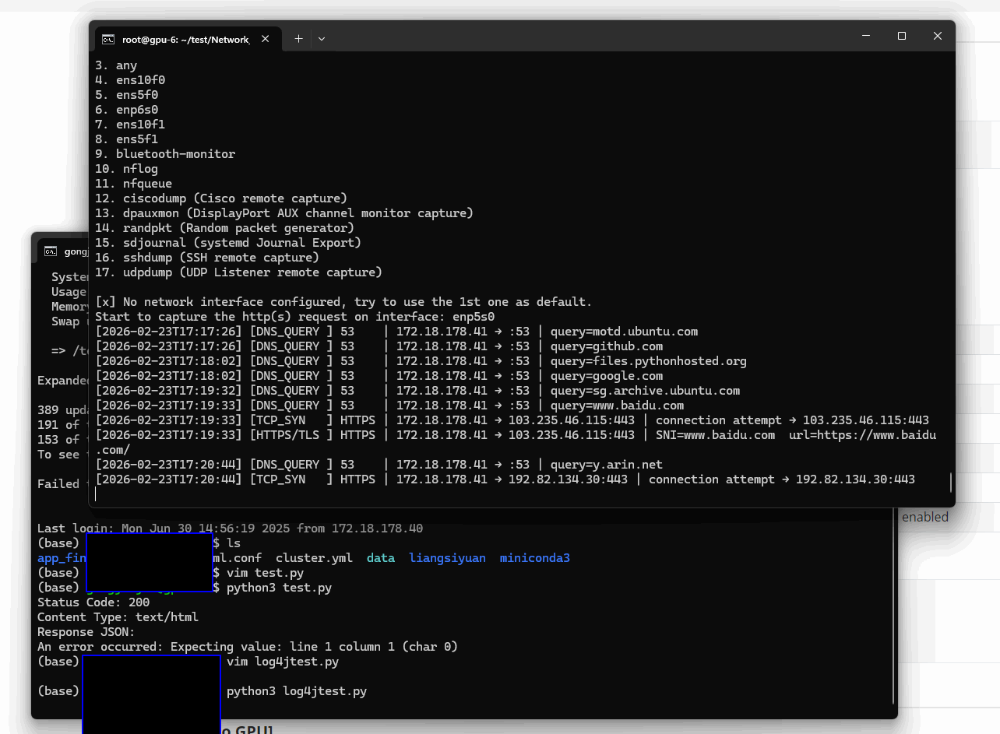

# Http(s) Request Logger

This module is used to log all the outgoing http(s) request send out from a Ubuntu machine to collect data to analyze whether there is any malicious activities generated from the host. The data will be record in the `Logs`fodler. This project includes 5 module as shown below. All the module need to be run under `sudo` permission. 

------

#### httpRequestLogger.py

One local HTTP/HTTPS Traffic Monitor using pyshark (tshark) : Captures outbound HTTP/HTTPS traffic from a network interface logs all the requests to log files. It will only capture the success sent out request. The function included: 

- HTTP (port 80) traffic is fully decoded: method, host, URI, headers.
- HTTPS (port 443) traffic shows IP/port metadata only (TLS is encrypted).
- For full HTTPS decryption you would need the server's private key or use SSLKEYLOGFILE with a supporting application (see --keylog option).

Requirements Lib:

```
sudo apt install tshark
sudo pip3 install pyshark --break-system-packages
```

Run the program:

```
sudo python3 httpRequestLogger.py 
```


------

#### httpRecorder.py

HTTP/HTTPS/DNS outgoing Request Monitor for Ubuntu Records ALL outbound HTTP/HTTPS requests, including those to non-existent domains. The program workflow is shown below :

- Sniffs raw packets on port 80 (HTTP) and 443 (HTTPS/TLS)
- Extracts HTTP Host headers + method + path for clear-text HTTP
- Extracts TLS SNI from ClientHello for HTTPS (no decryption needed)
- Captures DNS queries (port 53) to record intent before TCP connects
- Logs TCP SYN packets as a fallback for connections with no readable payload
- Writes to both stdout and a rotating log file

Requirements Lib:

```
sudo apt install tshark
sudo apt-get install python3-pip libpcap-dev tcpdump
sudo pip3 install scapy --break-system-packages
```

Run the program:

```
sudo python httpRecorder.py
```


------

#### Other Modules :  

- **Log.py** : This module is used to log the program execution information.(info, warning, debug, error)
- **RequestTest.py**: Send a simple request from another none admin user to see whether the request  can be logged by the `httpRequestLogger.py`
- **log4jtest.py** : Send a simple log4j request from another none admin user to see whether the request can be logged by the `httpRecorder.py`


------

### Execution example:

When you 1st time run it you will see this: 

```
2026-02-23 16:30:45,398 INFO     Start the local http(s) request logger module.
2026-02-23 16:30:45,609 INFO     Available interfaces:
1. enp0s31f6
2. any
3. lo (Loopback)
4. bluetooth-monitor
5. nflog
6. nfqueue
7. dbus-system
8. dbus-session
9. ciscodump (Cisco remote capture)
10. dpauxmon (DisplayPort AUX channel monitor capture)
11. randpkt (Random packet generator)
12. sdjournal (systemd Journal Export)
13. sshdump (SSH remote capture)
14. udpdump (UDP Listener remote capture)
15. wifidump (Wi-Fi remote capture)
2026-02-23 16:30:45,610 INFO     [x] No network interface configured, try to use the 1st one as default.
2026-02-23 16:30:45,612 INFO     Start to capture the http(s) request on interface: enp0s31f6
2026-02-23 16:30:52,612 INFO     [2026-02-23T16:30:52] [DNS_QUERY ] 53    | 172.26.191.38 → :53 | query=123.com
```

This is because we has not set the NIC we want to record, so it will list all the NIC of the machine and default select the 1st one, you can change the NIC by modify the parameter **gCurrentNIC** with the name current we use to link to the firewall as shown below:



The execution example log is show below running the program as admin and capture the outgoing data from another user:




------

> Last edit by LiuYuancheng (liu_yuan_cheng@hotmail.com) at 24/02/2026, if there is any problem or bug please send me a message.